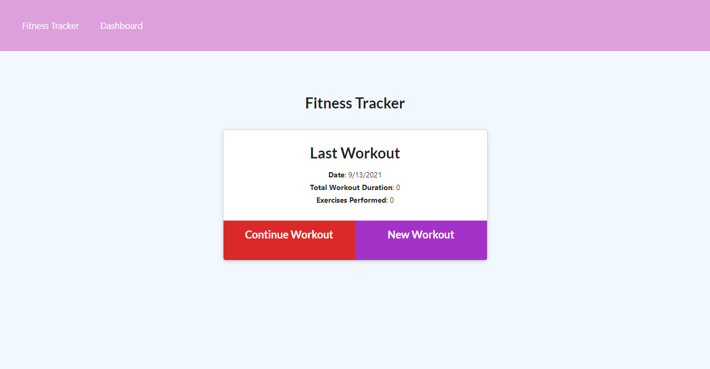

# Fitness Tracker

This project lets you view create and track daily workouts. You are able to log multiple exercises in a workout on a given day. You will also able to track the name, type, weight, sets, reps, and duration of exercise. If the exercise is a cardio exercise, you will be able to track your distance traveled.

## Description

Motivation for this project to be able to route functionality and allow button clicks AND user input to be considered to then used for outputting information for the user.
I built this project to be able to test whether or not user input could be taken and used logged with multiple input options.
The problem that this project solves is now being able to neatly analyze your workouts (in terms of Resistance or Cardio workouts) and help you keep track of how well you are doing!
I learned how to connect routes a bit better, handle event functions better, see how 'duration' is effective in tracking, and see how I could have a website keep track of an amount of something!

## Table of Contents

- [Installation](#installation)
- [Usage](#usage)
- [Credits](#credits)
- [License](#license)

## Installation

- Git clone the repo (https://github.com/LYBLRey/FitnessTracker)
- npm i
- Separate terminal run mongo or mongod (OR just open mongod application and leave it open (maybe windows only))
- node seeders/seeds.js
- node server.js

## Usage

You will be asked to set workouts (one at a time), of Resistance or Cardio workouts!
Once you input your workout information, you can click at the top right to check your Fitness Tracker which will then show you how well you are doing!

## Credits

- https://medium.com/markdown-monster-blog/getting-images-into-markdown-documents-and-weblog-posts-with-markdown-monster-9ec6f353d8ec
- https://expressjs.com/en/guide/routing.html
- https://developer.mozilla.org/en-US/docs/Web/JavaScript/Reference/Statements/async_function
-

## License

MIT License

Copyright (c) 2021 Sareybodd Chhorn

Permission is hereby granted, free of charge, to any person obtaining a copy
of this software and associated documentation files (the "Software"), to deal
in the Software without restriction, including without limitation the rights
to use, copy, modify, merge, publish, distribute, sublicense, and/or sell
copies of the Software, and to permit persons to whom the Software is
furnished to do so, subject to the following conditions:

The above copyright notice and this permission notice shall be included in all
copies or substantial portions of the Software.

THE SOFTWARE IS PROVIDED "AS IS", WITHOUT WARRANTY OF ANY KIND, EXPRESS OR
IMPLIED, INCLUDING BUT NOT LIMITED TO THE WARRANTIES OF MERCHANTABILITY,
FITNESS FOR A PARTICULAR PURPOSE AND NONINFRINGEMENT. IN NO EVENT SHALL THE
AUTHORS OR COPYRIGHT HOLDERS BE LIABLE FOR ANY CLAIM, DAMAGES OR OTHER
LIABILITY, WHETHER IN AN ACTION OF CONTRACT, TORT OR OTHERWISE, ARISING FROM,
OUT OF OR IN CONNECTION WITH THE SOFTWARE OR THE USE OR OTHER DEALINGS IN THE
SOFTWARE.
